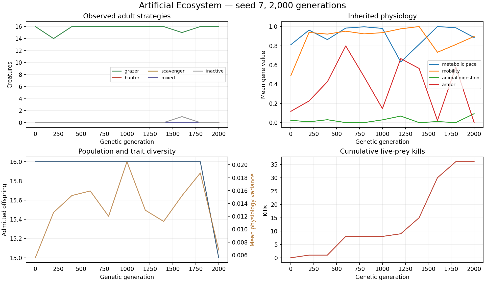

# Recorded experiment

Seed 7; 2,000 actual genetic generations;
status `completed`; final population 15.
Measured simulation time: 18.4 seconds, summed across workers.

The first live-prey kill occurred in generation 90. There were 36 kills from 678 attacks.
Assimilated energy totals: plants 396593.8,
carrion 820.6, live prey 191.8.

Last sampled adult cohort (generation 2,000):
16 grazers, 0 hunters,
0 scavengers, 0 mixed,
0 inactive.
Mean mass 0.650, metabolic pace 0.885,
mobility 0.897, diet 0.093,
armor 0.000, reproductive reserve 0.000.
Mean physiology variance 0.006786.

Energy ledger residual: 1.20231e-07 energy units, versus
424357 cumulative input.

These are observations from one finite-population simulation. They depend on
its resource supply, discrete cohort life cycle, mutation settings and neural
controller. They do not establish universal evolutionary outcomes. Strategy
labels describe actual intake; they were not assigned to creatures in advance.
The summary and lossless checkpoint record the complete settings.
